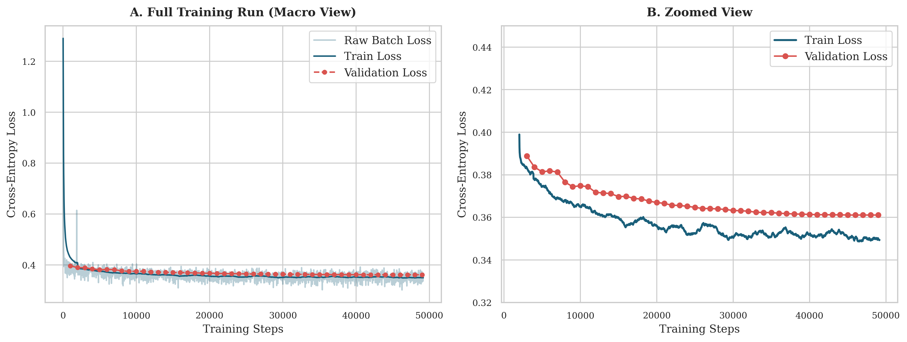
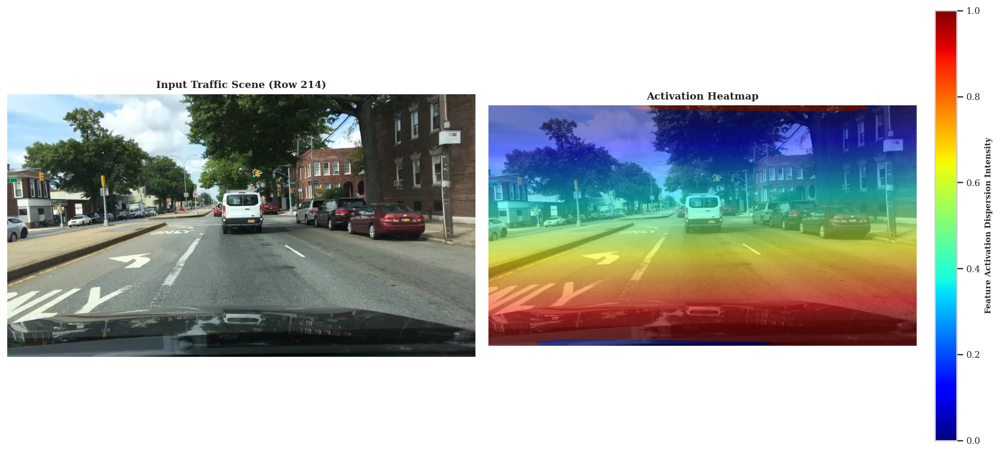
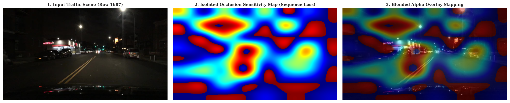
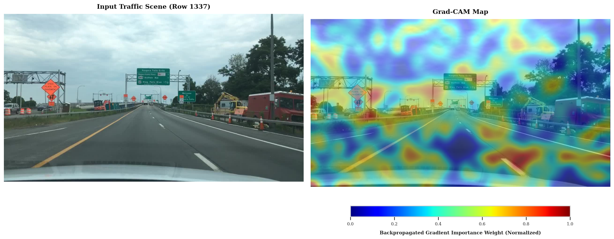

# Vlm_XAI
**Leveraging Vision-Language Models for Obstacle and Hazard Identification in Urban Traffic Scenes**  

A Qwen3-VL-4B model is finetuned on the BDD100K dataset across four perception and reasoning tasks; scene captioning, anomaly recognition, object detection and open-vocabulary perception. Using parameter-efficient fine-tuning via LoRA, the model achieves a good performance across all tasks verified by the quantitative evaluation is employed. Similarly, to validate that predictions reflect true scene understanding rather than spurious correlations, qualitative evaluation is also employed. Three Explainable AI (XAI) techniques; Occlusion Sensitivity Analysis, Visual Attention Map Extraction and Multimodal Grad-CAM are used for this validation. Analysis revealed critical differences in these techniques as Attention Map Extraction and Occlusion Sensitivity provided a higher-fidelity causal grounding compared to Multimodal Grad-CAM.  

<figure align="center">
  
  <figcaption>
    <em>Fig1. Training vs Validation loss </em>
  </figcaption>
</figure>

<figure align="center">
  
  <figcaption>
    <em>Fig2. Attention Map Extraction on random scene </em>
  </figcaption>
</figure>

<figure align="center">
  
  <figcaption>
    <em>Fig.3. Occlusion Sensitivity on random scene</em>
  </figcaption>
</figure>
<figure align="center">
  
  <figcaption>
    <em>Fig.4. Multimodal Grad-CAM on random scene</em>
  </figcaption>
</figure>

 
<b>Qwen3VL reference</b>

@article{Qwen3-VL,
      title={Qwen3-VL Technical Report}, 
      author={Shuai Bai and Yuxuan Cai and Ruizhe Chen and Keqin Chen and Xionghui Chen and Zesen Cheng and Lianghao Deng and Wei Ding and Chang Gao and Chunjiang Ge and Wenbin Ge and Zhifang Guo and Qidong Huang and Jie Huang and Fei Huang and Binyuan Hui and Shutong Jiang and Zhaohai Li and Mingsheng Li and Mei Li and Kaixin Li and Zicheng Lin and Junyang Lin and Xuejing Liu and Jiawei Liu and Chenglong Liu and Yang Liu and Dayiheng Liu and Shixuan Liu and Dunjie Lu and Ruilin Luo and Chenxu Lv and Rui Men and Lingchen Meng and Xuancheng Ren and Xingzhang Ren and Sibo Song and Yuchong Sun and Jun Tang and Jianhong Tu and Jianqiang Wan and Peng Wang and Pengfei Wang and Qiuyue Wang and Yuxuan Wang and Tianbao Xie and Yiheng Xu and Haiyang Xu and Jin Xu and Zhibo Yang and Mingkun Yang and Jianxin Yang and An Yang and Bowen Yu and Fei Zhang and Hang Zhang and Xi Zhang and Bo Zheng and Humen Zhong and Jingren Zhou and Fan Zhou and Jing Zhou and Yuanzhi Zhu and Ke Zhu},
	  journal={arXiv preprint arXiv:2511.21631},
      year={2025}
}
