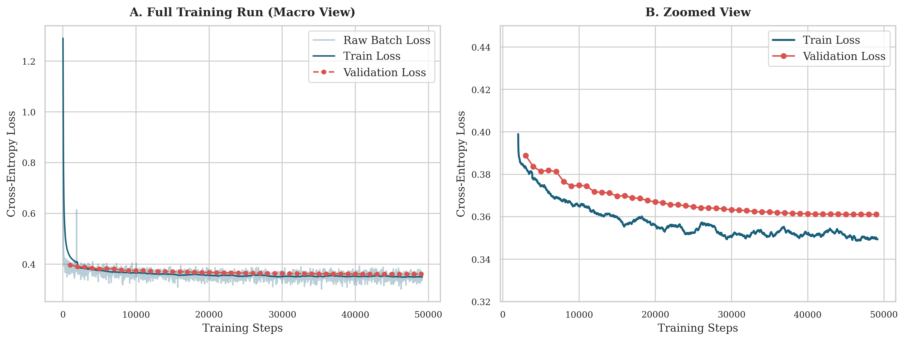
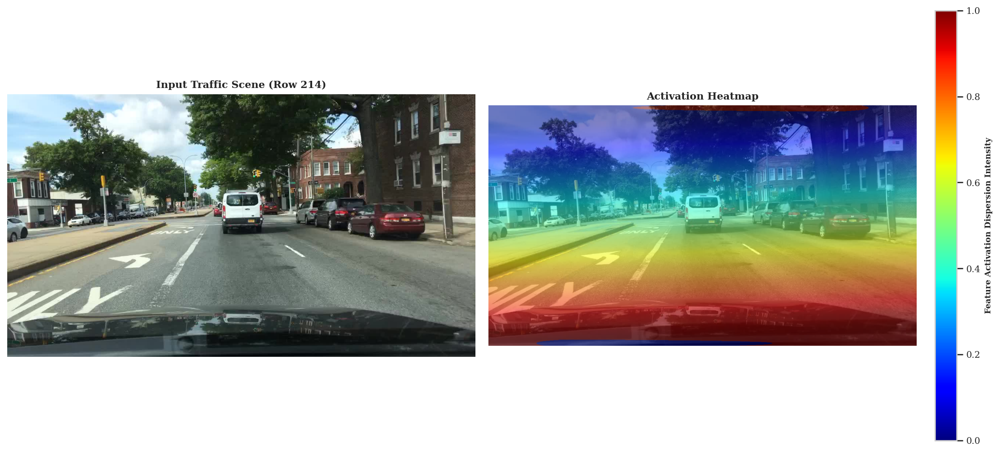
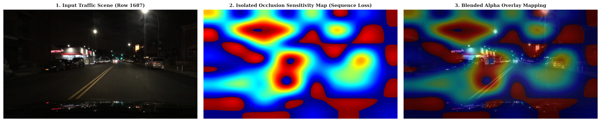
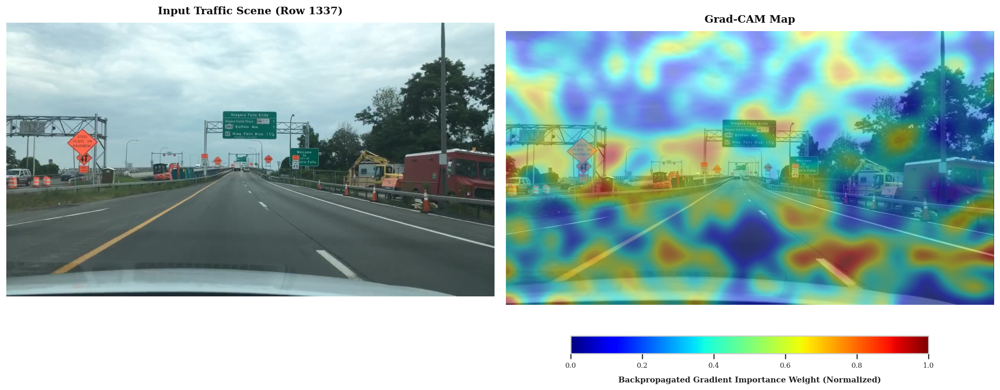

# Vlm_XAI
**Leveraging Vision-Language Models for Obstacle and Hazard Identification in Urban Traffic Scenes**  

A Qwen3-VL-4B model is finetuned on the BDD100K dataset across four perception and reasoning tasks; Multilabel Object Recognition,Environmental Scene Understanding,Hazard and Anomaly Detection and Scene Captioning. Using parameter-efficient fine-tuning via LoRA, the model shows task-dependent performance changes with improvements in environmental understanding and hazard recall, but increased object-class hallucinations and hazard false alarms, while captioning results remain mixed. Quantitative evaluation is therefore complemented by qualitative analysis using Visual Attention Map Extraction, Occlusion Sensitivity Analysis and Multimodal Grad-CAM to examine how model outputs are supported by visual regions in the traffic scene. The three XAI techniques provide complementary explanations, with attention highlighting relative visual focus, occlusion measuring perturbation sensitivity and Grad-CAM identifying positive gradient-weighted contribution to the generated response. 

<figure align="center">
  
  <figcaption>
    <em>Fig1. Training vs Validation loss </em>
  </figcaption>
</figure>

<figure align="center">
  
  <figcaption>
    <em>Fig2. Attention Map Extraction on random scene </em>
  </figcaption>
</figure>

<figure align="center">
  
  <figcaption>
    <em>Fig.3. Occlusion Sensitivity on random scene</em>
  </figcaption>
</figure>
<figure align="center">
  
  <figcaption>
    <em>Fig.4. Multimodal Grad-CAM on random scene</em>
  </figcaption>
</figure>

 
<b>Qwen3VL reference</b>

@article{Qwen3-VL,
      title={Qwen3-VL Technical Report}, 
      author={Shuai Bai and Yuxuan Cai and Ruizhe Chen and Keqin Chen and Xionghui Chen and Zesen Cheng and Lianghao Deng and Wei Ding and Chang Gao and Chunjiang Ge and Wenbin Ge and Zhifang Guo and Qidong Huang and Jie Huang and Fei Huang and Binyuan Hui and Shutong Jiang and Zhaohai Li and Mingsheng Li and Mei Li and Kaixin Li and Zicheng Lin and Junyang Lin and Xuejing Liu and Jiawei Liu and Chenglong Liu and Yang Liu and Dayiheng Liu and Shixuan Liu and Dunjie Lu and Ruilin Luo and Chenxu Lv and Rui Men and Lingchen Meng and Xuancheng Ren and Xingzhang Ren and Sibo Song and Yuchong Sun and Jun Tang and Jianhong Tu and Jianqiang Wan and Peng Wang and Pengfei Wang and Qiuyue Wang and Yuxuan Wang and Tianbao Xie and Yiheng Xu and Haiyang Xu and Jin Xu and Zhibo Yang and Mingkun Yang and Jianxin Yang and An Yang and Bowen Yu and Fei Zhang and Hang Zhang and Xi Zhang and Bo Zheng and Humen Zhong and Jingren Zhou and Fan Zhou and Jing Zhou and Yuanzhi Zhu and Ke Zhu},
	  journal={arXiv preprint arXiv:2511.21631},
      year={2025}
}
